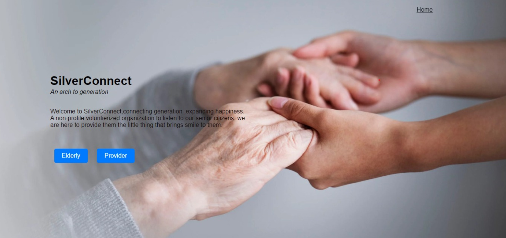
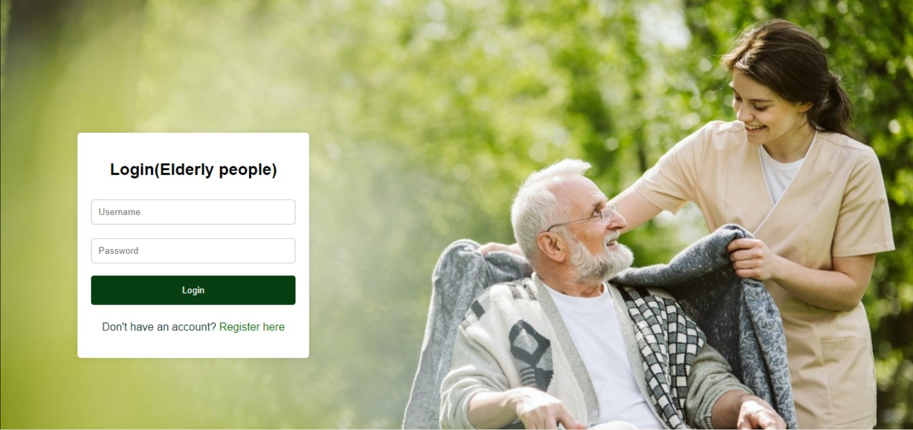
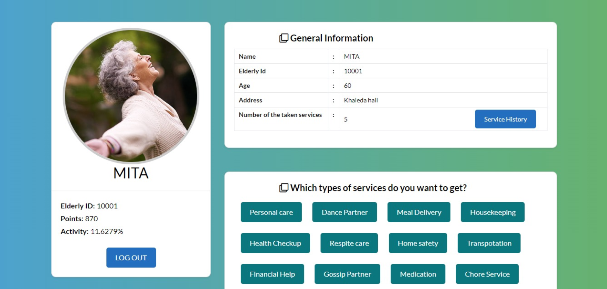
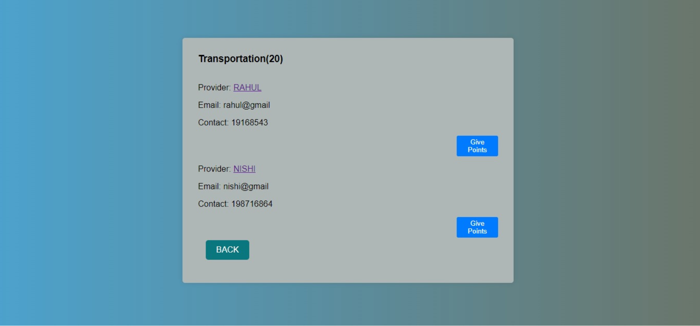
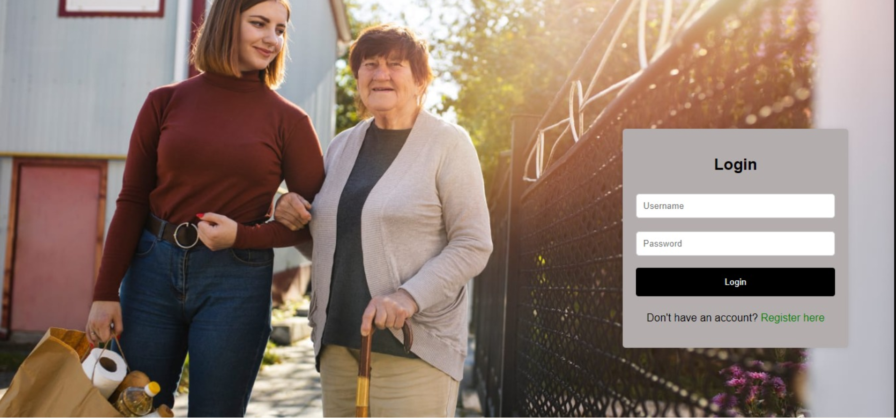
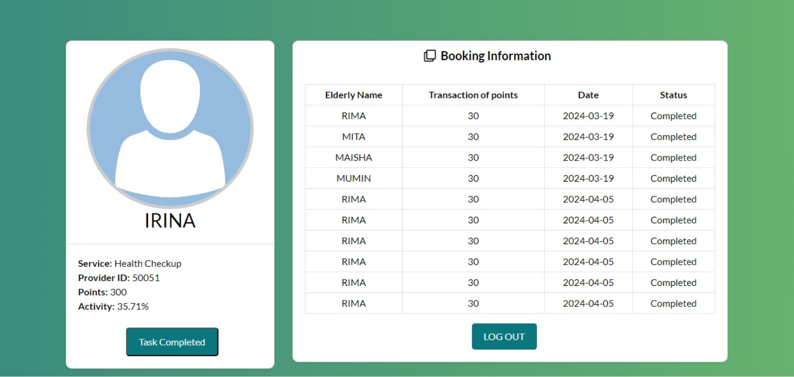
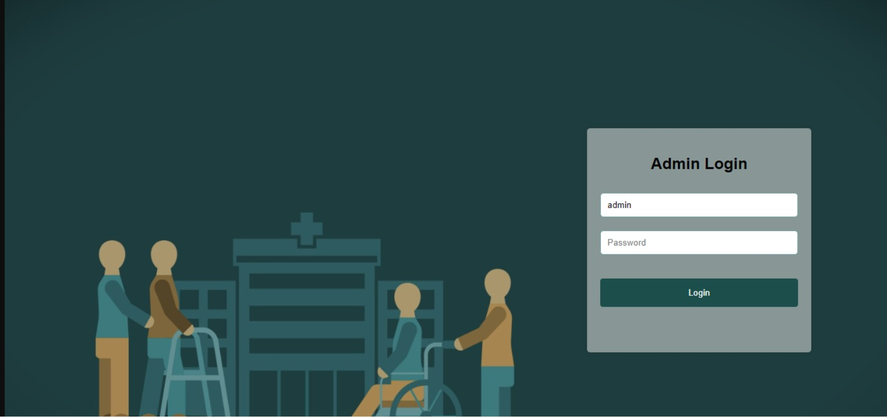
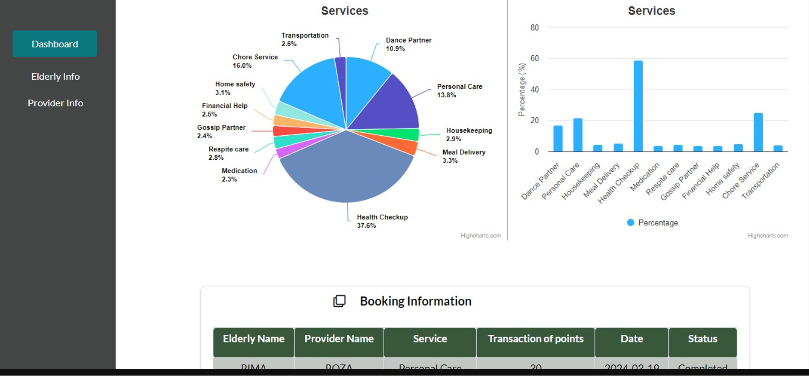

# Silver-Connect

Welcome to SilverConnect, connecting generation, expanding happiness. A non-profile voluntierized organization to listen to our senior citizens. we are here to provide them the little thing that brings smile to them.This project aims to provide invaluable support and assistance to residents of old age homes through a technology-driven approach. Our initiative focuses on developing a system that integrates various technologies to enhance the overall quality of life for elderly individuals with the help of young digital natives .The proposed project encompasses a range of services tailored to the unique needs of the elderly residents, For Example, amusement, medication,health monitoring and much more.

# Landing Page

# Login Page(Elderly)

# Profile Page(Elderly)

# Service Providers List

If an elderly wants to take a service like transportation ,he/she will click on the button of TRANSPORTATION. After contacting with a service provider,the elderly will give points to the corresponding provider to provide required services.Then the following page will be shown:

# Login Page(Service Provider)

# Profile Page (Service Provider)

Once the service has been completed, the service provider will click the **Task Completed** button to confirm the completion of the assigned task. This action finalizes the service request, marking the entire process as successfully completed.

# Admin Login Page

An administrator is assigned to oversee and manage the transaction process, ensuring that all service transactions are conducted accurately and efficiently.

# Admin Dashboard

In conclusion, the primary objective of this project was to create a platform that connects elderly individuals with young volunteers to facilitate essential services while fostering meaningful intergenerational relationships. The system was developed after recognizing the needs of elderly people who require additional care and support in their daily lives, as well as the willingness of many enthusiastic young adults to dedicate their time to helping others.

The proposed solution successfully addresses these needs by providing an efficient and user-friendly platform for requesting, managing, and completing service tasks. Overall, the developed system fulfills its intended objectives and demonstrates the potential to improve the quality of life for elderly individuals while encouraging social responsibility and stronger connections between generations.

